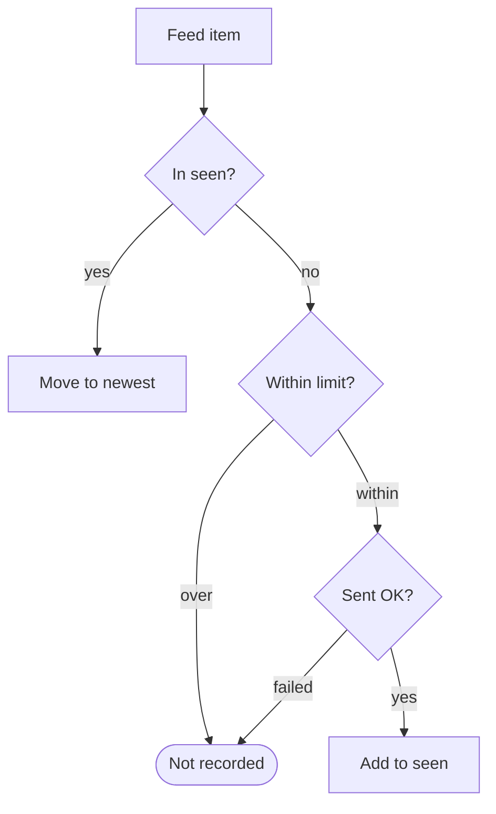

[🇯🇵 日本語](README.md) | [🇬🇧 English](README.en.md)

# tg-dev-digest

[](https://github.com/yktsnet/tg-dev-digest/actions/workflows/ci.yml)

A daily batch job that delivers software-development articles to Telegram. Hatena Bookmark, Zenn, and GitHub Trending are built in, and any other site can be added by putting its RSS feed in the config. Claude Haiku only picks article numbers, the list of already-sent URLs lives on a git branch, and the whole thing runs on GitHub Actions with no server.

```
📰 開発 digest
• [はてブ] AI-SQLエンジン「Quail」公開 ——LLMによるデータの絞り込み・結合を効率化
https://gihyo.jp/article/2026/09/quail

• [Zenn] Claude Codeで定期的にやっておきたい MEMORY.md の大掃除
https://zenn.dev/loglass/articles/f69996279763ab

🔥 GitHub Trending
• anthropics/claude-plugins-official
Official, Anthropic-managed directory of high quality Claude Code Plugins.
https://github.com/anthropics/claude-plugins-official
```

The motivation and the monthly API cost ($0.28) are written up on Zenn (Japanese).

https://zenn.dev/yktsnet/articles/202608-hatena-github-digest

## Quick Start

With Python 3.11+, you can preview today's digest locally without any API key or bot.

```bash
git clone https://github.com/yktsnet/tg-dev-digest.git
cd tg-dev-digest
python -m tg_dev_digest --dry-run
```

This fetches live data and prints the messages that would be sent. Without `ANTHROPIC_API_KEY` the filter is skipped and the header is marked "未選別" (unfiltered). The sent-URL record (`seen.txt`) is not written.

To receive it on Telegram every day, fork the repository and register secrets for Actions. See [docs/deploy.en.md](docs/deploy.en.md).

## Usage

```bash
python -m tg_dev_digest --dry-run                     # print instead of sending
python -m tg_dev_digest --dry-run --sources trending  # only some sources from digest.toml
python -m tg_dev_digest                               # send (needs Telegram credentials)
```

### Configuration

Sources, counts, and the filter criterion live in `digest.toml`.

```toml
[filter]
model = "claude-haiku-4-5"
topic = "AIやソフトウェア開発"   # goes into the prompt as "articles related to ..."

[seen]
max = 200                        # how many sent URLs to remember

[[source]]
name = "zenn"
type = "zenn"
label = "Zenn"
limit = 20                       # how many new items to handle per run
filter = true                    # let Haiku pick, and bundle into "📰 開発 digest"
```

Sources with `filter = true` arrive bundled in one message; the others arrive as one message per source. `enabled = false` turns a source off.

There are three `type`s.

| type | Reads | Used for |
|---|---|---|
| `feed` | RSS 1.0 / 2.0 / Atom | Hatena Bookmark, Qiita popular, Publickey, dev.to, Hacker News (hnrss), etc. |
| `zenn` | Zenn API daily ranking | Zenn (its feed is chronological only) |
| `trending` | GitHub Trending HTML | GitHub Trending (no feed, no API). Accepts `language` / `since` |

A source with a feed needs only `type = "feed"` and a `url`; no code.

Only two things are changed through environment variables: `DIGEST_SOURCES` (e.g. `zenn,trending` sends only those sources for that run) and `DIGEST_CONFIG` (path to the config file). Anything structured goes in `digest.toml`.

## Design Decisions

### Haiku returns only numbers

The filter input is one article per line, and the output is just `{"ids":[3,7,12]}`. Titles, URLs, and source names come from the local article data.

Earlier versions had the model return titles and matched them against local data. When the model changed even one space or symbol, the match failed, and Telegram received truncated titles with no source name. Some days a `"` inside a title broke the JSON. Numbers avoid both, and keep output tokens, which dominate the cost, to a few dozen.

When several sources cover the same event, the model is told to pick only one.

### Filtering is decided per source

Hatena Bookmark and Zenn mix in unrelated articles, so they go through Haiku. GitHub Trending is valuable precisely because you see what is growing in the English-speaking world regardless of field, so its top entries are sent as-is. Filtering is not applied to the whole run; each `[[source]]` sets its own `filter`.

### Sent URLs live on a state branch

An Actions runner starts clean every time, so the URLs sent so far have to live somewhere. `actions/cache` expires after seven days without access, so it is not used. Instead, a single `seen.txt` sits on the repository's `state` branch, rebuilt as one parentless commit and force-pushed on every run. The main history stays clean, and the state is readable with `git show`.

It remembers the latest 200 URLs, and each feed item is handled like this.



An article still on a feed is moved to the newest end every time it is seen. Even one that stays on a ranking for weeks is never pushed past 200 and never re-sent; only articles that have dropped off every feed age out. With the default setup about 85 items are listed at once (Hatena 30, Zenn 30, Trending 25), so 200 is enough.

Items that are not recorded become candidates again on the next run: those skipped for exceeding the limit arrive on a later day, and those whose send failed are retried. Articles rejected by the filter are recorded together with a successful send, so Haiku does not judge them again the next day.

URLs are compared after normalizing `utm_*`, trailing `/`, anything after `#`, and http vs https. A Zenn article that also trends on Hatena Bookmark arrives only once.

### One failure does not stop the rest

Failures in fetching, filtering, and sending are each contained. If one source fails the others are still sent, and on a day the filter fails, everything is sent with an "未選別" (unfiltered) header. A run with any failure exits with code 1, so it shows red in the Actions UI.

## Tech Stack

| Layer | Technology | Reason |
|---|---|---|
| Runtime | GitHub Actions (schedule) | A job that runs once a day for tens of seconds needs no server. Fits in the free tier |
| Language | Python 3.11+ (standard library only) | `urllib`, `html.parser`, `xml.etree`, and `tomllib` are enough. No pip install, so the same command runs on Actions and locally |
| Filter | Claude Haiku (`claude-haiku-4-5`) | It only picks matching numbers from a list, so the cheapest model that suffices is used. Swappable via `[filter].model` |
| State | git branch (`state`) | Too small for a database, and `actions/cache` expires in seven days. Using the repository itself needs no extra service |
| Delivery | Telegram Bot API | Up to 4096 characters per message, so even a long digest splits rarely |

## Scope

- **Does**: filters articles and delivers them without duplicates, daily, to one chat
- **Does not**: summarize, fetch article bodies, track read state, route to multiple chats, or provide a web viewer
- **May break**: GitHub Trending is scraped from HTML, so a DOM change on GitHub's side breaks it. Actions schedules can be delayed by hours when busy

Behavior fixed by tests is listed in [docs/guarantees.en.md](docs/guarantees.en.md). Anything not listed there is not a promise.

## License

MIT
