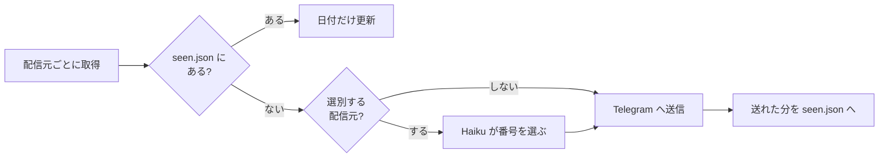

# tg-dev-digest

はてなブックマーク・Zenn・GitHub Trending から開発まわりの記事を毎日集め、Claude Haiku に選ばせて Telegram へ流す。サーバーは持たず、GitHub Actions だけで回る。

```
📰 開発 digest
• [はてブ] AI-SQLエンジン「Quail」公開 ——LLMによるデータの絞り込み・結合を効率化
https://gihyo.jp/article/2026/09/quail

• [Zenn] Claude Codeで定期的にやっておきたい MEMORY.md の大掃除
https://zenn.dev/loglass/articles/f69996279763ab

🔥 GitHub Trending
• anthropics/claude-plugins-official
Official, Anthropic-managed directory of high quality Claude Code Plugins.
https://github.com/anthropics/claude-plugins-official
```

作った経緯と、1か月の API 料金（0.28ドル）は Zenn に書いた。

https://zenn.dev/yktsnet/articles/202608-hatena-github-digest

## 流れ



- **選別は配信元ごとに決める。** はてブと Zenn は関心外の記事が混ざるので Haiku に選ばせ、GitHub Trending は分野を絞らずに眺めたいのでそのまま送る。
- **Haiku には記事の番号だけを返させる。** タイトルを返させると、モデルが書き換えたときに元の記事と突き合わせられず、タイトル中の `"` で JSON も壊れていた。番号なら出力は数十トークンで済む。同じ出来事を扱う記事が複数あれば1件に絞らせている。
- 選別が失敗した日は、見出しに「未選別」と付けてそのまま届ける。配信元が1つ落ちても、残りは届く。

## 重複を消す仕組み

送った URL は、リポジトリの `state` ブランチに置いた `seen.json` に記録する。中身は `{正規化した URL: 最後にフィードで見かけた日}` で、実行のたびに1コミットへ作り直して force-push する。main の履歴は汚れない。

記録するのは「最後に見かけた日」なので、ランキングに何週間居座る記事も二度と届かない。どのフィードからも消えて `DIGEST_SEEN_TTL_DAYS`（既定30日）が過ぎたら忘れる。

- 選別で落ちた記事も記録するので、翌日また Haiku に判定させることはない
- 件数の上限を超えて今回見送った記事は記録しないので、翌日以降の候補に残る
- 送信に失敗した分は記録しないので、次の実行で送り直す
- URL は `utm_*`・末尾の `/`・`#` 以降・http と https の違いを揃えてから比べる。はてブに上がった Zenn 記事が Zenn 側にも出ても、1回しか届かない

## 使い方

GitHub で fork するか clone して自分のリポジトリに置き、Actions の secrets を3つ登録する。

| secret | 中身 |
|---|---|
| `ANTHROPIC_API_KEY` | 選別に使う。未登録なら全件を未選別で送る |
| `TELEGRAM_BOT_TOKEN` | BotFather で Bot を作って得るトークン |
| `TELEGRAM_CHAT_ID` | Bot に一度話しかけてから `https://api.telegram.org/bot<TOKEN>/getUpdates` を開くと出る `chat.id` |

これで毎日 JST 22:27 に `.github/workflows/digest.yml` が動く。schedule は混雑すると数時間遅れる。Actions のタブから手で起動するときは、`dry_run` を選ぶと送らずにログへ出す。

手元では環境変数を渡して動かす。依存は Python 3.10 以上の標準ライブラリだけ。

```bash
python -m tg_dev_digest --dry-run                    # 送らずに標準出力へ。seen も書かない
python -m tg_dev_digest --dry-run --sources trending
TELEGRAM_BOT_TOKEN=... TELEGRAM_CHAT_ID=... ANTHROPIC_API_KEY=... python -m tg_dev_digest
python -m unittest discover -s tests
```

## 設定

どれも環境変数で渡す。Actions では Settings → Secrets and variables → Actions の **Variables** に登録すれば、コードを変えずに切り替えられる。空のままなら既定値になる。

| 変数 | 既定 | 中身 |
|---|---|---|
| `DIGEST_SOURCES` | `hatena,zenn,trending` | 使う配信元と並び順。`trending` を外せば Trending の配信は止まる |
| `DIGEST_FILTER_SOURCES` | `hatena,zenn` | Haiku に選ばせる配信元。ここに無い配信元は全件そのまま送る |
| `DIGEST_TOPIC` | `AIやソフトウェア開発` | 選別の基準。プロンプトの「〜に関係する記事」に入る |
| `DIGEST_LIMITS` | `hatena=20,zenn=20,trending=3`（独自フィードは10） | 配信元ごとの1回あたりの新着件数。`zenn=10,trending=5` のように一部だけ書ける |
| `DIGEST_FEEDS` | なし | 独自の RSS / Atom を `名前=URL` のカンマ区切りで足す。名前を `DIGEST_SOURCES` にも書く |
| `DIGEST_SEEN_TTL_DAYS` | `30` | フィードから消えた記事を忘れるまでの日数 |
| `HATENA_CATEGORY` | `it` | はてブのホットエントリのカテゴリ（`it` / `general` / `entertainment` など） |
| `TRENDING_LANGUAGE` | なし | `python` などを入れると言語別の Trending になる |
| `TRENDING_SINCE` | なし（daily） | `weekly` / `monthly` |
| `ANTHROPIC_MODEL` | `claude-haiku-4-5` | 選別に使うモデル |

配信元を足す例:

```
DIGEST_FEEDS=publickey=https://www.publickey1.jp/atom.xml
DIGEST_SOURCES=hatena,zenn,publickey,trending
DIGEST_FILTER_SOURCES=hatena,zenn,publickey
```

`DIGEST_FILTER_SOURCES` に入れた配信元は「📰 開発 digest」に混ぜて届く。入れなければ、配信元ごとに別のメッセージで届く。

## 構成

| ファイル | 役割 |
|---|---|
| `tg_dev_digest/sources/` | 配信元ごとの取得と解析。`feed.py` が RSS 1.0 / 2.0 / Atom を読み、はてブと独自フィードはこれを使う |
| `tg_dev_digest/seen.py` | `seen.json` の読み書きと期限切れの掃除 |
| `tg_dev_digest/select.py` | Haiku へのプロンプトと、返ってきた番号の解釈 |
| `tg_dev_digest/telegram.py` | 4096 文字の上限に収まるよう分けてメッセージを組む |
| `tg_dev_digest/digest.py` | 取得 → 重複除外 → 選別 → 送信 → 記録をつなぐ。HTTP・LLM・送信先は引数で受け取り、テストは偽物で回す |

GitHub Trending には API が無いので HTML を読んでいる。GitHub 側の DOM が変わると取れなくなる。

## License

MIT
