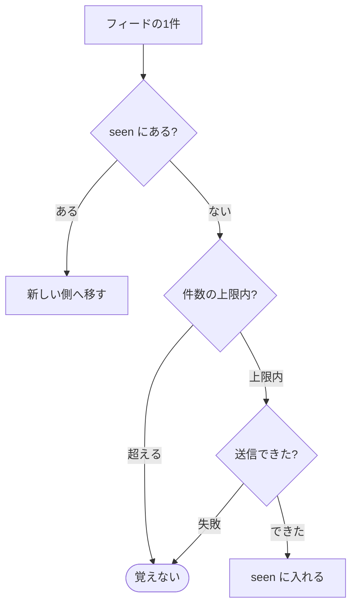

# tg-dev-digest

[](https://github.com/yktsnet/tg-dev-digest/actions/workflows/ci.yml)

このリポは、はてなブックマーク・Zenn・GitHub Trending から開発まわりの記事を毎日 Telegram へ届けるバッチで、Claude Haiku には記事の番号だけを選ばせ、送信済みの URL は GitHub のブランチに持たせて、サーバーを置かずに GitHub Actions だけで回す。

```
📰 開発 digest
• [はてブ] AI-SQLエンジン「Quail」公開 ——LLMによるデータの絞り込み・結合を効率化
https://gihyo.jp/article/2026/09/quail

• [Zenn] Claude Codeで定期的にやっておきたい MEMORY.md の大掃除
https://zenn.dev/loglass/articles/f69996279763ab

🔥 GitHub Trending
• anthropics/claude-plugins-official
Official, Anthropic-managed directory of high quality Claude Code Plugins.
https://github.com/anthropics/claude-plugins-official
```

作った動機と、1か月の API 料金（0.28ドル）は Zenn に書いた。

https://zenn.dev/yktsnet/articles/202608-hatena-github-digest

## Quick Start

Python 3.11 以上があれば、キーも Bot も無しで、今日届く内容を手元で見られる。

```bash
git clone https://github.com/yktsnet/tg-dev-digest.git
cd tg-dev-digest
python -m tg_dev_digest --dry-run
```

実データを取って、送る予定のメッセージを標準出力に出す。`ANTHROPIC_API_KEY` が無いので選別は飛ばされ、見出しに「未選別」と付く。送信済みの記録（`seen.txt`）も書かない。

毎日 Telegram に届くようにするには、fork して Actions に secrets を登録する。手順は [docs/deploy.md](docs/deploy.md)。

## Usage

```bash
python -m tg_dev_digest --dry-run                     # 送らずに標準出力へ
python -m tg_dev_digest --dry-run --sources trending  # digest.toml のうち一部だけ
python -m tg_dev_digest                               # 送信する（Telegram の資格情報が要る）
```

### Configuration

配信元・件数・選別の基準は `digest.toml` に書く。

```toml
[filter]
model = "claude-haiku-4-5"
topic = "AIやソフトウェア開発"   # プロンプトの「〜に関係する記事」に入る

[seen]
max = 200                        # 送信済みとして覚えておく URL の件数

[[source]]
name = "zenn"
type = "zenn"
label = "Zenn"
limit = 20                       # その回に新しく扱う件数
filter = true                    # Haiku に選ばせて「📰 開発 digest」にまとめる
```

`filter = true` の配信元は1通にまとめて届き、それ以外は配信元ごとに別の1通で届く。`enabled = false` を書けばその配信元は止まる。

`type` は3つある。

| type | 読むもの | 使う配信元 |
|---|---|---|
| `feed` | RSS 1.0 / 2.0 / Atom | はてブ、Qiita 人気記事、Publickey、dev.to、Hacker News（hnrss）など |
| `zenn` | Zenn API のデイリーランキング | Zenn（フィードは新着順しか無い） |
| `trending` | GitHub Trending の HTML | GitHub Trending（フィードも API も無い）。`language` / `since` を足せる |

フィードのある配信元は `type = "feed"` と `url` を書けば足り、コードは要らない。

環境変数で変えられるのは `DIGEST_SOURCES`（`zenn,trending` のように書くと、その回はこれだけを送る）と `DIGEST_CONFIG`（設定ファイルの場所）の2つだけ。構造のある設定は `digest.toml` に置く。

## Design Decisions

### Haiku には番号だけを返させる

選別の入力は1行1件の記事一覧で、出力は `{"ids":[3,7,12]}` だけにしている。タイトルと URL と配信元の名前は、手元の記事データから出す。

以前はタイトルを返させて手元のデータと突き合わせていた。モデルが空白や記号を1文字でも変えると突き合わせに失敗し、Telegram に途切れたタイトルが配信元の名前なしで届いた。タイトル中の `"` で JSON が壊れる日もあった。番号ならどちらも起きず、料金の大半を占める出力トークンも数十で済む。

同じ出来事を扱う記事が複数の配信元から来たら、1件だけ選ばせている。

### 選別するかを配信元ごとに決める

はてブと Zenn は関心外の記事が混ざるので Haiku を通す。GitHub Trending は、分野を絞らずに英語圏で何が伸びているかを眺めること自体に価値があるので、通さずに上位をそのまま送る。選別を実行全体に一律でかけず、`[[source]]` ごとの `filter` で決める。

### 送信済みの URL を state ブランチに持つ

Actions のランナーは毎回まっさらなので、前回までに送った URL をどこかに置く必要がある。`actions/cache` は7日触られないと消えるので使わず、リポジトリの `state` ブランチに `seen.txt` を1ファイルだけ置き、実行のたびに親の無い1コミットへ作り直して force-push する。main の履歴は汚れず、状態は `git show` で読める。

覚えるのは直近200件で、フィードの1件は次のように扱う。



フィードに載っている記事は、見かけるたびに一覧の新しい側へ移す。ランキングに何週間居座る記事でも200件の外へ押し出されず、再送されない。外れていくのは、どのフィードからも消えた記事だけになる。各フィードに同時に載るのは既定の構成で85件ほど（はてブ 30・Zenn 30・Trending 25）なので、200件で足りる。

覚えない記事は、次の実行で改めて候補になる。上限を超えて今回見送った記事は翌日以降に届き、送信に失敗した記事は送り直される。選別で落ちた記事は送信の成功と同時に覚えるので、翌日また Haiku に判定させることはない。

URL は `utm_*`・末尾の `/`・`#` 以降・http と https の違いを揃えてから比べる。はてブに上がった Zenn の記事が Zenn 側にも出ても、1回しか届かない。

### 1つが落ちても残りは届ける

配信元の取得・選別・送信の失敗は、それぞれの単位で閉じる。1つの配信元が落ちても残りは送り、選別が失敗した日は見出しに「未選別」と付けて全件を送る。失敗があった実行は終了コード 1 で終わるので、Actions の画面で赤く見える。

## Tech Stack

| Layer | Technology | Reason |
|---|---|---|
| 実行 | GitHub Actions（schedule） | 1日1回・数十秒で終わる処理にサーバーを置く理由が無い。無料枠に収まる |
| 言語 | Python 3.11+（標準ライブラリのみ） | `urllib`・`html.parser`・`xml.etree`・`tomllib` で足りる。pip install が要らないので、Actions でも手元でも同じコマンドで動く |
| 選別 | Claude Haiku（`claude-haiku-4-5`） | 記事一覧から条件に合う番号を拾うだけなので、足りる中で一番安いモデルを使う。`[filter].model` で差し替えられる |
| 状態 | git ブランチ（`state`） | DB を立てるほどの量ではなく、`actions/cache` は7日で消える。リポジトリ自体を置き場にすれば追加のサービスが要らない |
| 配信 | Telegram Bot API | 1通 4096 字まで送れて、長い digest でも分割が少ない |

## Scope

- **やること**: 記事の選別と、重複なしの配信。1つのチャットへの日次配信
- **やらないこと**: 要約・本文の取得・既読管理・複数チャットへの振り分け・Web の閲覧画面
- **壊れうるところ**: GitHub Trending は HTML を読んでいるので、GitHub 側の DOM が変わると取れなくなる。Actions の schedule は混雑すると数時間遅れる

テストで固定している振る舞いは [docs/guarantees.md](docs/guarantees.md) にある。そこに無い振る舞いは約束ではない。

## License

MIT
