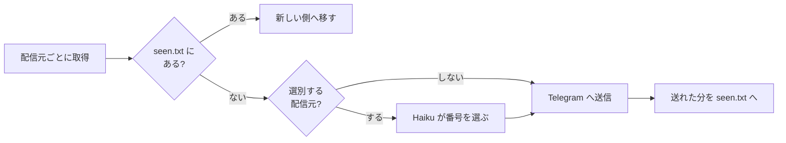

# tg-dev-digest

はてなブックマーク・Zenn・GitHub Trending から開発まわりの記事を毎日集め、Claude Haiku に選ばせて Telegram へ流す。サーバーは持たず、GitHub Actions だけで回る。

```
📰 開発 digest
• [はてブ] AI-SQLエンジン「Quail」公開 ——LLMによるデータの絞り込み・結合を効率化
https://gihyo.jp/article/2026/09/quail

• [Zenn] Claude Codeで定期的にやっておきたい MEMORY.md の大掃除
https://zenn.dev/loglass/articles/f69996279763ab

🔥 GitHub Trending
• anthropics/claude-plugins-official
Official, Anthropic-managed directory of high quality Claude Code Plugins.
https://github.com/anthropics/claude-plugins-official
```

作った経緯と、1か月の API 料金（0.28ドル）は Zenn に書いた。

https://zenn.dev/yktsnet/articles/202608-hatena-github-digest

## 流れ



- **選別は配信元ごとに決める。** はてブと Zenn は関心外の記事が混ざるので Haiku に選ばせ、GitHub Trending は分野を絞らずに眺めたいのでそのまま送る。
- **Haiku には記事の番号だけを返させる。** タイトルを返させると、モデルが書き換えたときに元の記事と突き合わせられず、タイトル中の `"` で JSON も壊れていた。番号なら出力は数十トークンで済む。同じ出来事を扱う記事が複数あれば1件に絞らせている。
- 選別が失敗した日は、見出しに「未選別」と付けてそのまま届ける。配信元が1つ落ちても、残りは届く。

## 重複を消す仕組み

送った URL は、リポジトリの `state` ブランチに置いた `seen.txt` に直近200件だけ覚えておく。実行のたびに1コミットへ作り直して force-push するので、main の履歴は汚れない。

フィードにまだ載っている記事は、見かけるたびに一覧の新しい側へ移す。ランキングに何週間居座る記事でも押し出されず、二度と届かない。外れていくのは、どのフィードからも消えた記事だけになる。各フィードに同時に載るのは既定の構成で合わせて85件ほど（はてブ 30・Zenn 30・Trending 25）なので、200件あれば足りる。

- 選別で落ちた記事も覚えるので、翌日また Haiku に判定させることはない
- 件数の上限を超えて今回見送った記事は覚えないので、翌日以降の候補に残る
- 送信に失敗した分は覚えないので、次の実行で送り直す
- URL は `utm_*`・末尾の `/`・`#` 以降・http と https の違いを揃えてから比べる。はてブに上がった Zenn 記事が Zenn 側にも出ても、1回しか届かない

## 使い方

GitHub で fork するか clone して自分のリポジトリに置き、Actions の secrets を3つ登録する。

| secret | 中身 |
|---|---|
| `ANTHROPIC_API_KEY` | 選別に使う。未登録なら全件を未選別で送る |
| `TELEGRAM_BOT_TOKEN` | BotFather で Bot を作って得るトークン |
| `TELEGRAM_CHAT_ID` | Bot に一度話しかけてから `https://api.telegram.org/bot<TOKEN>/getUpdates` を開くと出る `chat.id` |

これで毎日 JST 22:27 に `.github/workflows/digest.yml` が動く。schedule は混雑すると数時間遅れる。Actions のタブから手で起動するときは、`dry_run` を選ぶと送らずにログへ出す。

手元では環境変数を渡して動かす。依存は Python 3.11 以上の標準ライブラリだけ。

```bash
python -m tg_dev_digest --dry-run                    # 送らずに標準出力へ。seen も書かない
python -m tg_dev_digest --dry-run --sources trending
TELEGRAM_BOT_TOKEN=... TELEGRAM_CHAT_ID=... ANTHROPIC_API_KEY=... python -m tg_dev_digest
python -m unittest discover -s tests
```

## 設定

配信元・件数・選別の基準は `digest.toml` に書く。コメントに各項目の意味がある。

```toml
[filter]
model = "claude-haiku-4-5"
topic = "AIやソフトウェア開発"   # プロンプトの「〜に関係する記事」に入る

[[source]]
name = "zenn"
type = "zenn"
limit = 20        # その回に新しく扱う件数
filter = true     # Haiku に選ばせて「📰 開発 digest」にまとめる
```

`filter = true` の配信元は1通にまとめて届き、それ以外は配信元ごとに別のメッセージで届く。`enabled = false` を書けばその配信元は止まる。

`type` は3つ。

| type | 読むもの | 向いている配信元 |
|---|---|---|
| `feed` | RSS 1.0 / 2.0 / Atom | はてブ、Qiita 人気記事、Publickey、dev.to、Hacker News（hnrss）など、フィードがあるもの全般 |
| `zenn` | Zenn API のデイリーランキング | Zenn（フィードは新着順しか無いため） |
| `trending` | GitHub Trending の HTML | GitHub Trending（フィードも API も無いため）。`language` / `since` を足せる |

フィードがある配信元は `type = "feed"` と URL を書けば足りる。専用の読み方が要るのは、フィードが無いか、欲しいランキングがフィードに出ていない配信元だけ。

環境変数で渡すのは、秘密情報と次の2つだけ。

| 変数 | 中身 |
|---|---|
| `DIGEST_SOURCES` | `zenn,trending` のように書くと、その回は `digest.toml` からこれだけを送る。Actions の Variables に置けば常時の絞り込みになる |
| `DIGEST_CONFIG` | 設定ファイルの場所（既定 `digest.toml`） |

## 構成

| ファイル | 役割 |
|---|---|
| `tg_dev_digest/sources/` | 配信元ごとの取得と解析。`feed.py` が RSS 1.0 / 2.0 / Atom を読み、はてブと独自フィードはこれを使う |
| `tg_dev_digest/config.py` | `digest.toml` と環境変数の読み込み |
| `tg_dev_digest/seen.py` | `seen.txt` の読み書き。直近200件を残す |
| `tg_dev_digest/select.py` | Haiku へのプロンプトと、返ってきた番号の解釈 |
| `tg_dev_digest/telegram.py` | 4096 文字の上限に収まるよう分けてメッセージを組む |
| `tg_dev_digest/digest.py` | 取得 → 重複除外 → 選別 → 送信 → 記録をつなぐ。HTTP・LLM・送信先は引数で受け取り、テストは偽物で回す |

GitHub Trending には API が無いので HTML を読んでいる。GitHub 側の DOM が変わると取れなくなる。

## License

MIT
